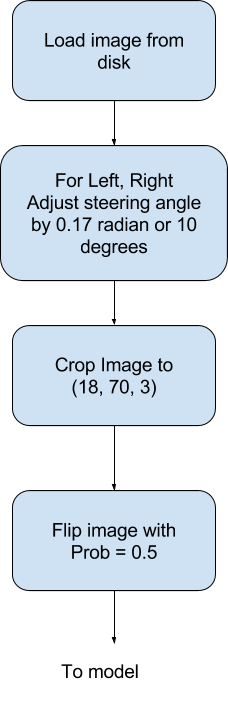

#Training Data Distribution
The histogram below shows us how the training data is biased towards 0.0 angle. This means model is more like to predict an angle that is closer to 0.0 .


#Visual Training Data Samples
Let’s take a look at training data and explore how the pictures look.

##Center images: Random Maximum and Minimum angle


##Center images: Randomly selected


#Training Data Analysis


##Images are too big
Images are of size 160x320 pixels. Large images causes two issues

* Training on irrelevant data. Trees and topography has no impact on steering decisions. Sky and by inference weather may have some impact on steering decisions. Let’s assume for this simulation that weather has no impact and therefore we can ignore sky, surrounding topography and flora fauna.

* Proposed model architecture will have more 100M parameters with the image size. However, if we reduce the image by 25%, the number of parameters shrink dramatically (by many orders of magnitude). 250,000 parameter model could take 15-20 minutes to train and that’s what I am targeting for.

*Inference: Crop the image*


##Training Data is Biased Towards 0.0
If we only consider center images then the above distribution shows that there is a bias towards 0.0 angles. This will cause the model to overfit and predict angles that are closer to 0.0

*Inference: Use left and right images and correct angles.*


##Too Much Training Data for Memory
8000 images are a lot. It won’t fit in memory and will slow down the CPU. Thus, we need to build a training data pipeline using generators


#Training Data Pipeline
Using generators, we can create a training data pipeline. I have borrowed flip algorithm from upul (https://github.com/upul/behavioral_cloning)




##Angles are Clustered
Negative and positive angles are clustered. That means when the car is turning left then it has a lot of angles that make it turning left. This is logical in the way car drives but it may cause an issue in the way model learns to predict angles. There are chances of local maxima and the model overfitting. This overfitting maybe cause the model to predict negative and positive angles ONLY in certain conditions and overfit for training data on those angles.

###Clustering of angle signs###


# Network Architecture
(Reference: https://github.com/wonjunee/behavioral-cloning)

```
Layer (type)                     Output Shape          Param #     Connected to                     
====================================================================================================
convolution2d_1 (Convolution2D)  (None, 16, 78, 16)    448         convolution2d_input_1[0][0]      
____________________________________________________________________________________________________
activation_1 (Activation)        (None, 16, 78, 16)    0           convolution2d_1[0][0]            
____________________________________________________________________________________________________
convolution2d_2 (Convolution2D)  (None, 14, 76, 8)     1160        activation_1[0][0]               
____________________________________________________________________________________________________
activation_2 (Activation)        (None, 14, 76, 8)     0           convolution2d_2[0][0]            
____________________________________________________________________________________________________
convolution2d_3 (Convolution2D)  (None, 12, 74, 4)     292         activation_2[0][0]               
____________________________________________________________________________________________________
activation_3 (Activation)        (None, 12, 74, 4)     0           convolution2d_3[0][0]            
____________________________________________________________________________________________________
convolution2d_4 (Convolution2D)  (None, 10, 72, 2)     74          activation_3[0][0]               
____________________________________________________________________________________________________
activation_4 (Activation)        (None, 10, 72, 2)     0           convolution2d_4[0][0]            
____________________________________________________________________________________________________
maxpooling2d_1 (MaxPooling2D)    (None, 5, 36, 2)      0           activation_4[0][0]               
____________________________________________________________________________________________________
dropout_1 (Dropout)              (None, 5, 36, 2)      0           maxpooling2d_1[0][0]             
____________________________________________________________________________________________________
flatten_1 (Flatten)              (None, 360)           0           dropout_1[0][0]                  
____________________________________________________________________________________________________
dense_1 (Dense)                  (None, 16)            5776        flatten_1[0][0]                  
____________________________________________________________________________________________________
activation_5 (Activation)        (None, 16)            0           dense_1[0][0]                    
____________________________________________________________________________________________________
dense_2 (Dense)                  (None, 16)            272         activation_5[0][0]               
____________________________________________________________________________________________________
activation_6 (Activation)        (None, 16)            0           dense_2[0][0]                    
____________________________________________________________________________________________________
dense_3 (Dense)                  (None, 16)            272         activation_6[0][0]               
____________________________________________________________________________________________________
activation_7 (Activation)        (None, 16)            0           dense_3[0][0]                    
____________________________________________________________________________________________________
dropout_2 (Dropout)              (None, 16)            0           activation_7[0][0]               
____________________________________________________________________________________________________
dense_4 (Dense)                  (None, 1)             17          dropout_2[0][0]                  
====================================================================================================
Total params: 8311
```

# Training Results

|  Learning Rate | Epochs | Steering Angle Correction (Radian) | % Flipped | Channels | Model | Driving Quality Track 1 | Time on Track2 | Validation Loss | Validation Accuracy | Test Score Accuracy |
|  :------: | :------: | :------: | :------: | :------: | :------: | :------: | :------: | :------: | :------: | :------: |
|  0.001 | 5 | 0.17 | 0.5 | 3 | Architecture A | Drunk | 1 minute | 0.014 | 0.175 | 0.186 |
|  0.0001 | 5 | 0.17 | 0.5 | 3 | Architecture A | Accident | 10 seconds | 0.0141 | 0.1773 | 0.186 |
|  0.01 | 5 | 0.17 | 0.5 | 3 | Architecture A | Accident | 4 seconds | 0.0416 | 0.1773 | 0.186 |
|  0.001 | 10 | 0.17 | 0.5 | 3 | Architecture A | Accident | 5 seconds | 0.0136 | 0.1742 | 0.186 |
|  0.0015 | 10 | 0.17 | 0.5 | 3 | Architecture A | Accident | 25 seconds | 0.0124 | 0.1803 | 0.186 |
|  0.0015 | 5 | 0.17 | 0.5 | 3 | Architecture A | Novice | 3 minutes | 0.01041 | 0.1856 | 0.186 |
|  0.0015 | 5 | 0.17 | 0.5 | 3 | Architecture A | Novice | 3 minutes | 0.0149 | 0.1773 | 0.186 |
|  0.002 | 5 | 0.17 | 0.5 | 3 | Architecture A | Novice++ | 5 seconds | 0.014 | 0.1818 | 0.186 |
|  0.002 | 5 | 0.2 | 0.5 | 3 | Architecture A | Accident | 5 seconds | 0.0144 | 0.178 | 0.186 |
|  0.002 | 5 | 0.12 | 0.5 | 3 | Architecture A | Accident | 5 seconds | 0.0158 | 0.1826 | 0.186 |
|  0.002 | 5 | 0.12 | 0.5 | 3 | Architecture B | Novice | 10 seconds | 0.145 | 0.1924 | 0.186 |
|  0.002 | 10 | 0.15 | 0.5 | 3 | Architecture B | Accident | 5 seconds | 0.0164 | 0.178 | 0.186 |
|  0.0015 | 10 | 0.15 | 0.5 | 3 | Architecture C | Accident | 5 seconds | 0.0377 | 0.178 | 0.186 |
|  0.0015 | 20 | 0.17 | 0.5 | 3 | Architecture A | Accident | 5 seconds | 0.153 | 0.1689 | 0.186 |
